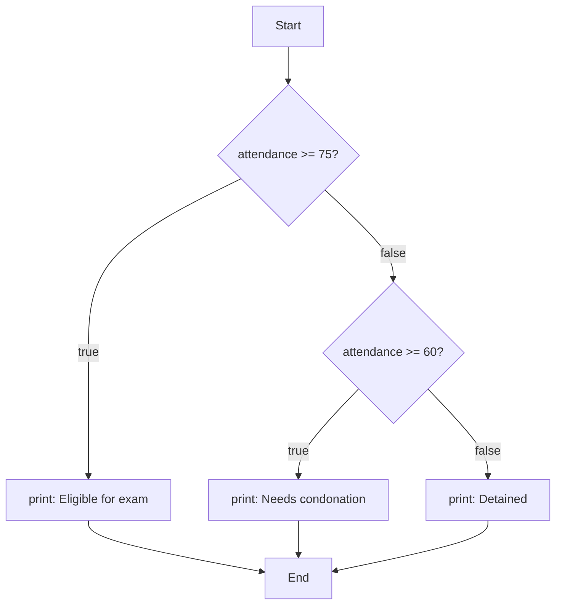
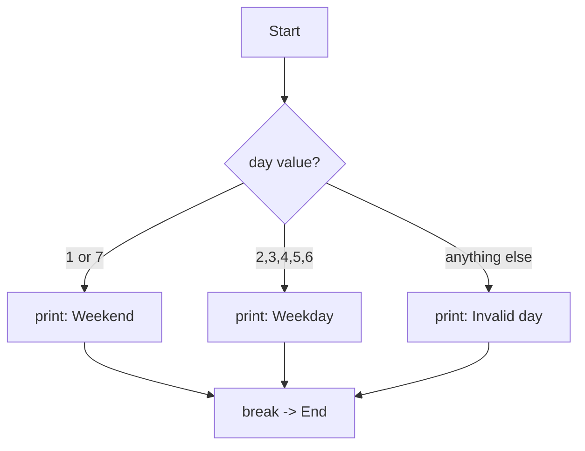
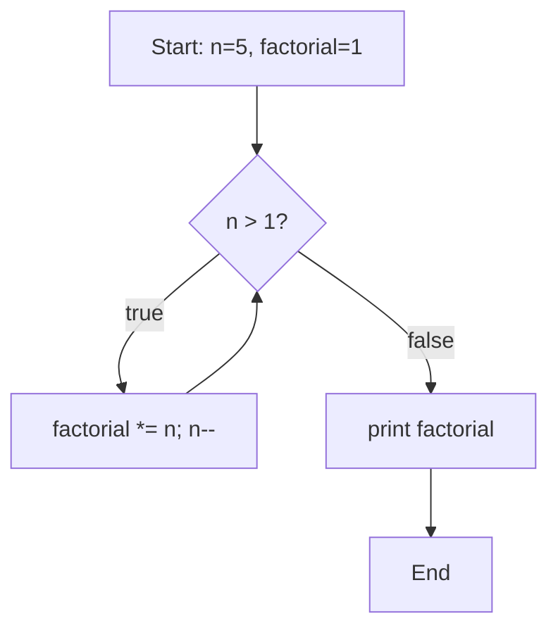
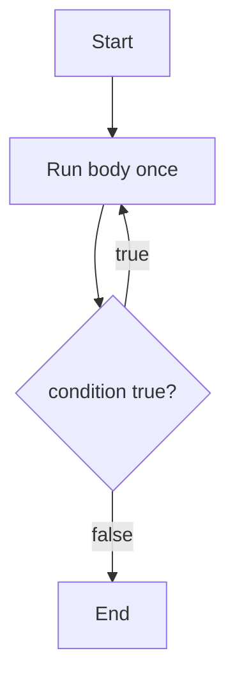
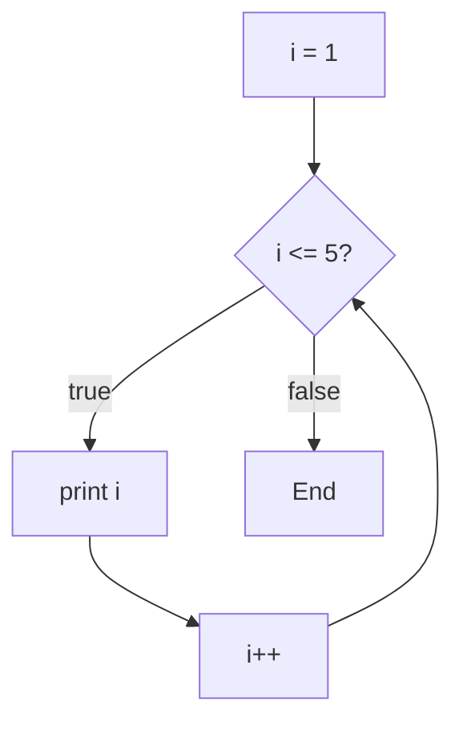

# **Control Flow in C++**

Control flow is the order in which statements in a program actually
run. By default C++ executes top to bottom, one statement after
another. Control flow statements let a program branch (choose between
paths) or loop (repeat a path), instead of always running every line
in order.

There are three families:

- **Selection** — `if`, `else if`, `else`, `switch`
- **Iteration** — `while`, `do-while`, `for`, range-`for`
- **Jump** — `break`, `continue`, `goto`, `return`

---

## 1. `if` / `else if` / `else`

### Syntax

```cpp
if (condition) {
    // runs only if condition is true
} else if (anotherCondition) {
    // runs only if the first was false AND this one is true
} else {
    // runs only if every condition above was false
}
```

`condition` must be something that can convert to `bool`. `0`, `0.0`,
`nullptr`, and an empty string comparison all behave as `false`;
anything else non-zero behaves as `true`.

### Example

```cpp
#include <iostream>

int main() {
    int attendance = 82;

    if (attendance >= 75) {
        std::cout << "Eligible for exam\n";
    } else if (attendance >= 60) {
        std::cout << "Needs condonation\n";
    } else {
        std::cout << "Detained\n";
    }

    return 0;
}
```

Output:
```
Eligible for exam
```

Only ONE branch ever runs. C++ checks conditions top to bottom and
stops at the first one that is true — the rest are skipped entirely,
even if they would also be true.

### Flow diagram



### Nested `if` and the dangling-else trap

```cpp
int marks = 55;
bool hasBacklog = false;

if (marks >= 40) {
    if (!hasBacklog) {
        std::cout << "Result: Pass\n";
    }
} else {
    std::cout << "Result: Fail\n";     // belongs to the OUTER if
}
```

An `else` always binds to the **nearest unmatched `if`** above it.
When nesting `if` inside `if`, always use braces `{ }` — without them,
an `else` you meant for the outer `if` can silently attach to the
inner one instead.

**Wrong (classic bug):**
```cpp
if (marks >= 40)
    if (!hasBacklog)
        std::cout << "Pass\n";
else                                // attaches to the INNER if, not outer!
    std::cout << "Fail\n";
```
Here, if `marks < 40`, nothing prints at all — the `else` never
belonged to the outer condition, even though the indentation suggests
it does.

---

## 2. `switch` / `case` / `default`

### Syntax

```cpp
switch (expression) {
    case value1:
        // code
        break;
    case value2:
        // code
        break;
    default:
        // code if nothing matched
}
```

`expression` must be an integer type, `char`, or an `enum` — never a
`std::string`, `double`, or `float`.

### Example

```cpp
#include <iostream>

int main() {
    int day = 3;

    switch (day) {
        case 1:
        case 7:
            std::cout << "Weekend\n";
            break;
        case 2:
        case 3:
        case 4:
        case 5:
        case 6:
            std::cout << "Weekday\n";
            break;
        default:
            std::cout << "Invalid day\n";
            break;
    }

    return 0;
}
```

Output:
```
Weekday
```

Stacking `case 1:` and `case 7:` with no code between them means both
values run the SAME block — a clean way to group cases without
repeating code.

### The `break` trap — fallthrough

```cpp
int level = 2;

switch (level) {
    case 3:
        std::cout << "Admin access\n";
        // no break — falls through!
    case 2:
        std::cout << "Write access\n";
        // no break — falls through!
    case 1:
        std::cout << "Read access\n";
        break;
    default:
        std::cout << "No access\n";
}
```

Output:
```
Write access
Read access
```

Forgetting `break` is the single most common `switch` bug — execution
does not stop at the matched case, it keeps running every case below
it until it hits a `break` or the end of the `switch`. If fallthrough
is intentional, mark it clearly:

```cpp
case 3:
    std::cout << "Admin access\n";
    [[fallthrough]];   // tells the compiler and the next reader: on purpose
case 2:
    ...
```

### Flow diagram



---

## 3. `while` loop

Repeats a block **while** a condition stays true. Condition is
checked **before** every iteration, including the first — so the body
may run zero times.

### Syntax

```cpp
while (condition) {
    // repeats as long as condition is true
}
```

### Example

```cpp
#include <iostream>

int main() {
    int n = 5;
    int factorial = 1;

    while (n > 1) {
        factorial *= n;
        --n;
    }

    std::cout << "5! = " << factorial << "\n";   // 120
    return 0;
}
```

### Flow diagram



### The infinite-loop trap

```cpp
int count = 0;
while (count < 5) {
    std::cout << count << "\n";
    // forgot: ++count;
}
```

If nothing inside the loop ever changes the condition, it never
becomes false — the loop runs forever. Every `while` needs something
inside it that moves the condition toward becoming false.

---

## 4. `do-while` loop

Same idea as `while`, but the condition is checked **after** the body
runs — so the body always executes **at least once**, even if the
condition is false from the start.

### Syntax

```cpp
do {
    // runs at least once
} while (condition);
```

Note the semicolon after `while (condition)` — required for
`do-while`, unlike a plain `while`.

### Example

```cpp
#include <iostream>

int main() {
    int choice;

    do {
        std::cout << "Menu: 1) Start  2) Exit\n";
        std::cin >> choice;
    } while (choice != 1 && choice != 2);

    std::cout << "You chose " << choice << "\n";
    return 0;
}
```

A menu is the textbook use case: you must show it at least once
before you have anything to check.

### `while` vs `do-while`

| | `while` | `do-while` |
|---|---|---|
| Condition checked | Before the body | After the body |
| Minimum runs | 0 | 1 |
| Typical use | General repetition | Input validation, menus |

### Flow diagram



---

## 5. `for` loop

Best when you know **how many times** to repeat, or you need a
counter. Packs initialization, condition, and update into one line.

### Syntax

```cpp
for (initialization; condition; update) {
    // repeats while condition is true
}
```

Execution order: `initialization` runs once → check `condition` → run
body → run `update` → check `condition` again → ... until `condition`
is false.

### Example

```cpp
#include <iostream>

int main() {
    for (int i = 1; i <= 5; ++i) {
        std::cout << "i = " << i << "\n";
    }
    return 0;
}
```

Output:
```
i = 1
i = 2
i = 3
i = 4
i = 5
```

### Flow diagram



### Counting down, and skipping values

```cpp
for (int i = 10; i > 0; i -= 2) {
    std::cout << i << " ";
}
// 10 8 6 4 2
```

### The off-by-one trap

```cpp
int marks[5] = {90, 85, 70, 60, 40};

for (int i = 0; i <= 5; ++i) {      // BUG: should be i < 5
    std::cout << marks[i] << "\n"; // reads marks[5], which does not exist
}
```

Valid indices for a 5-element array are `0` to `4`. Using `<=` instead
of `<` reads one element past the end — undefined behaviour, and a
very common beginner mistake. Always double-check array-loop bounds.

---

## 6. Range-based `for` (range-`for`)

Introduced in C++11. Walks every element of a container or array
directly, with no manual indexing and no risk of an off-by-one error.

### Syntax

```cpp
for (elementType element : container) {
    // uses element, one at a time
}
```

### Example — read-only

```cpp
#include <iostream>
#include <vector>

int main() {
    std::vector<std::string> names{"Karan", "Tanvi", "Rohit"};

    for (const std::string& name : names) {
        std::cout << name << "\n";
    }
    return 0;
}
```

`const std::string&` avoids copying every element — use this form
when you are only reading.

### Example — modifying elements

```cpp
std::vector<int> marks{60, 70, 80};

for (int& m : marks) {      // reference, NOT a copy
    m += 5;                  // modifies the actual element
}
// marks is now {65, 75, 85}
```

If you write `for (int m : marks)` (no `&`), `m` is a copy — changing
it inside the loop has no effect on the vector at all.

### `auto` with range-`for`

```cpp
for (auto& m : marks) {     // auto infers int, & keeps it a reference
    m *= 2;
}
```

`auto` is common here since the container's element type is usually
obvious from context.

| Form | Use when |
|---|---|
| `for (const auto& x : c)` | reading only, avoid copies |
| `for (auto& x : c)` | modifying elements in place |
| `for (auto x : c)` | working with a cheap-to-copy type (like `int`) |

---

## 7. `break`

Immediately exits the **innermost** loop or `switch` it is inside —
no more iterations, no condition check, execution jumps straight to
the first line after the loop/switch.

```cpp
#include <iostream>

int main() {
    for (int i = 1; i <= 10; ++i) {
        if (i == 6) {
            break;              // stop the loop entirely
        }
        std::cout << i << " ";
    }
    return 0;
}
```

Output:
```
1 2 3 4 5
```

The loop was written to go up to 10, but `break` cuts it short at 6.

---

## 8. `continue`

Skips the **rest of the current iteration** and jumps straight to the
next one (for `for`, that means running the update step, then
re-checking the condition). It does NOT exit the loop.

```cpp
#include <iostream>

int main() {
    for (int i = 1; i <= 10; ++i) {
        if (i % 2 == 0) {
            continue;           // skip even numbers
        }
        std::cout << i << " ";
    }
    return 0;
}
```

Output:
```
1 3 5 7 9
```

### `break` vs `continue`

| | `break` | `continue` |
|---|---|---|
| Effect | Exits the loop completely | Skips to the next iteration |
| Remaining iterations | None run | Still run, minus the skipped part |

### C++ has no labeled break

Unlike some languages, a bare `break` only escapes the loop it is
directly inside — never an outer one. The common workaround is a
boolean flag:

```cpp
bool stopOuter = false;

for (int i = 0; i < 3 && !stopOuter; ++i) {
    for (int j = 0; j < 3; ++j) {
        if (i == 1 && j == 1) {
            stopOuter = true;
            break;              // only exits the INNER loop
        }
        std::cout << "i=" << i << " j=" << j << "\n";
    }
}
```

---

## 9. `goto` (and why it is rarely used)

`goto` jumps directly to a **labeled** line, unconditionally.

```cpp
#include <iostream>

int main() {
    int retries = 0;

retry:
    ++retries;
    std::cout << "Attempt " << retries << "\n";
    if (retries < 3) {
        goto retry;
    }
    return 0;
}
```

`goto` makes code hard to follow because control can jump anywhere,
skipping the structured shape that `if`/`while`/`for` give a reader.
Modern C++ almost never needs it — `break`, `continue`, and `return`
cover the same ground far more safely. The one case still sometimes
seen: jumping out of deeply nested loops in old C-style code, though
even that is usually better solved with a flag or by moving the loops
into their own function and using `return`.

A hard rule: `goto` cannot jump forward into the scope of a variable
that has an initializer — the compiler rejects it, because the jump
would skip the variable's construction.

---

## 10. Quick reference

| Statement | Checks condition | Minimum runs | Typical use |
|---|---|---|---|
| `if` / `else` | Once | — | Branch based on a condition |
| `switch` | Once (matches a value) | — | Many fixed choices of one value |
| `while` | Before body | 0 | Repeat while unknown-length |
| `do-while` | After body | 1 | Menus, input validation |
| `for` | Before body | 0 | Known number of repetitions |
| range-`for` | Once per element | 0 | Walking a whole container |
| `break` | — | — | Exit the current loop/switch now |
| `continue` | — | — | Skip to the next iteration |
| `goto` | — | — | Unconditional jump (avoid) |

---

## 11. Practice (try these yourself)

- Write an `if`/`else if`/`else` chain that assigns a letter grade
  from a numeric mark, and test a value at every boundary (39, 40,
  59, 60, ...).
- Rewrite the fallthrough `switch` example so every case has its own
  `break`, and confirm the output changes.
- Turn the factorial `while` loop into a `for` loop, and back again.
- Write a `do-while` menu loop that only accepts `1`, `2`, or `3`,
  and re-prompts on anything else.
- Deliberately write the off-by-one array bug from Section 5, compile
  it, and see what value gets printed for the out-of-bounds access.
- Given a `std::vector<int>` of marks, use range-`for` to print only
  the values above 75, using `continue` to skip the rest.
- Write nested loops that print a 5x5 multiplication table, using
  `break` to stop the inner loop early once a product exceeds 20.