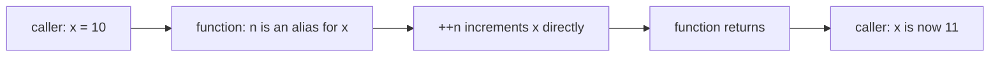
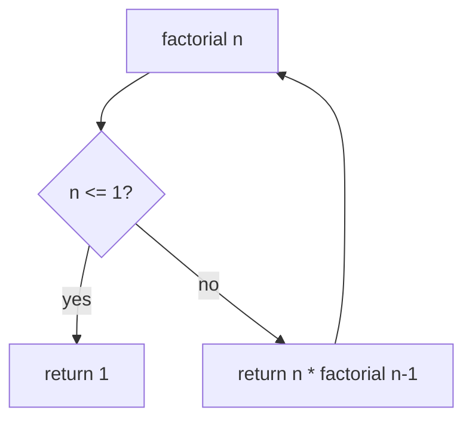

# **Functions in C++**

A function is a named, reusable block of code that performs a specific
task. Functions let you break a program into small, manageable pieces
that can be written once and used many times. The rule of thumb is:
if you copy-paste the same logic three times, it should become a
function.

Every C++ program has at least one function — `main` — and most real
programs contain many.

---

## **1. Anatomy of a function**

A function has three parts:

- A **return type** — what kind of value the function gives back
  (or `void` if it gives nothing back).
- A **name** — how you refer to the function. By convention, names
  use `camelCase` or `snake_case` consistently.
- A **parameter list** — inputs the function accepts, written as
  `(type name, type name, ...)` inside parentheses. An empty list
  means the function takes no inputs.

```cpp
returnType functionName(parameterList) {
    // body — code that runs when the function is called
    return value;          // required for non-void functions
}
```

### **Example**

```cpp
int add(int a, int b) {       // returns int, takes two ints
    return a + b;             // sends a result back to the caller
}
```

When a caller writes `add(3, 4)`, control jumps into the body, `a`
becomes `3`, `b` becomes `4`, the body runs, `return` sends `7` back,
and execution resumes in the caller with `7` in hand.

### **Flow diagram**


---

## **2. Function declaration vs definition**

These are two distinct things and the distinction matters.

- **Declaration** (a.k.a. *prototype*) tells the compiler the
  function exists: its name, return type, and parameter types.
  It ends with a semicolon and has no body.
- **Definition** is the actual body — the code that runs when the
  function is called.

### **Syntax**

```cpp
returnType functionName(parameterTypes);   // declaration
returnType functionName(parameterTypes) { // definition
    // body
}
```

### **Example**

```cpp
#include <iostream>

// Declaration — lets the compiler know add exists before it sees it
int add(int a, int b);

int main() {
    std::cout << add(3, 4) << "\n";   // works, because of the prototype above
    return 0;
}

// Definition — the real implementation
int add(int a, int b) {
    return a + b;
}
```

### **Why split them up?**

You usually need a declaration when a function is **called** before
it is **defined** in the file. The compiler reads top to bottom; if it
sees `add(3, 4)` without having seen `add`'s body, it needs a
prototype to know what `add` returns and accepts.

Header files (`add.h`) are mostly a way to share these declarations
across many `.cpp` files in a project.

---

## **3. `void` functions — returning nothing**

If a function does not produce a value, give it the return type
`void`. You can still `return;` early to exit, but you cannot
`return value;` — there is no value to return.

```cpp
#include <iostream>

void greet(std::string name) {     // no return value
    std::cout << "Hello, " << name << "!\n";
    // no return needed here — function ends naturally
}

void maybeGreet(std::string name, bool loud) {
    if (name.empty()) {
        return;                     // exit early, no value
    }
    if (loud) {
        std::cout << "HEY " << name << "!!!\n";
    } else {
        std::cout << "Hi, " << name << ".\n";
    }
}

int main() {
    greet("Karan");
    maybeGreet("", true);           // returns immediately, prints nothing
    maybeGreet("Tanvi", false);
    return 0;
}
```

Output:
```
Hello, Karan!
Hi, Tanvi.
```

`void` is also used for "out parameters" — when a function modifies
several values the caller needs, the function can be `void` and
write to its parameters (see references below).

---

## **4. Calling a function**

Calling a function runs its body. You call it by writing its name
followed by parentheses containing any arguments.

```cpp
#include <iostream>

int square(int x) {
    return x * x;
}

int main() {
    int r1 = square(5);          // direct call
    std::cout << r1 << "\n";     // 25

    std::cout << square(7) << "\n";   // 49, called inline inside another expression

    int n = 10;
    std::cout << square(n + 1) << "\n";  // 121 — the expression n+1 is evaluated first
    return 0;
}
```

A call is an expression; the result is whatever the function returns
(or nothing, for `void`).

---

## **5. Parameters and arguments**

These two words are easy to mix up:

- **Parameter** — the variable listed in the function's signature.
  It exists only inside the function. Also called the *formal
  parameter*.
- **Argument** — the actual value passed in by the caller. Also
  called the *actual parameter*.

```cpp
int add(int a, int b) {   // a, b are PARAMETERS
    return a + b;
}

add(3, 4);                // 3, 4 are ARGUMENTS
```

---

## **6. Pass by value (the default)**

By default, C++ passes arguments **by value** — the function gets its
own copy of the value. Changing the parameter inside the function
does NOT change the caller's variable.

```cpp
#include <iostream>

void increment(int n) {
    ++n;                      // changes the local copy only
    std::cout << "Inside: " << n << "\n";
}

int main() {
    int x = 10;
    increment(x);
    std::cout << "Outside: " << x << "\n";   // still 10
    return 0;
}
```

Output:
```
Inside: 11
Outside: 10
```

Pass by value is safe and predictable — no chance of accidentally
clobbering the caller's data — but expensive for large objects,
because the whole thing is copied every call.

### **Flow diagram**


---

## **7. Pass by reference**

Use `&` on a parameter to make it a reference — an alias for the
caller's variable. Changes inside the function now affect the
caller.

```cpp
#include <iostream>

void increment(int& n) {     // & makes n a reference
    ++n;                      // this changes the caller's variable
}

int main() {
    int x = 10;
    increment(x);
    std::cout << x << "\n";   // 11
    return 0;
}
```

References cannot be reseated (they always refer to the same thing
they were bound to) and cannot be null. The caller must pass an
actual lvalue — a variable, not a literal or a temporary.

```cpp
increment(10);               // ERROR: cannot bind reference to a literal
int a = 1, b = 2;
swap(a, b);                  // works — a and b are real variables
```

### **When to use references**

- To let the function modify the caller's value.
- To avoid copying a large object (use `const T&` when only reading).
- To make the call site read naturally: `swap(a, b)` not
  `swap(&a, &b)`.

### **Flow diagram**



---

## **8. Pass by pointer**

The C-style alternative. The function takes the *address* of the
caller's variable and dereferences it to read or modify the value.

```cpp
#include <iostream>

void increment(int* p) {     // p holds the ADDRESS of an int
    ++(*p);                   // *p means "the int at that address"
}

int main() {
    int x = 10;
    increment(&x);            // &x is the address of x
    std::cout << x << "\n";   // 11
    return 0;
}
```

A pointer can be null, can be reseated, and the syntax to use it is
heavier at the call site. For most modern C++ code, references are
preferred. Pointers still show up a lot for optional values
("pass `nullptr` if there is nothing"), arrays, and low-level code.

### **Reference vs pointer**

| | Reference `T&` | Pointer `T*` |
|---|---|---|
| Can be null | No | Yes |
| Can be reseated | No | Yes |
| Must be initialized | Yes, at declaration | Recommended |
| Syntax at call site | `f(x)` | `f(&x)` |
| Syntax inside function | `x` | `*x` |
| Typical use | Output, large input | Optional values, arrays, C interop |

---

## **9. Default arguments**

A parameter can have a default value. If the caller does not supply
that argument, the default is used. Defaults are set in the
declaration, not the definition.

```cpp
#include <iostream>
#include <string>

// declaration includes defaults
void greet(std::string name, std::string prefix = "Hello", char punct = '!');

void greet(std::string name, std::string prefix, char punct) {
    std::cout << prefix << ", " << name << punct << "\n";
}

int main() {
    greet("Karan");                       // Hello, Karan!
    greet("Tanvi", "Hi");                 // Hi, Tanvi!
    greet("Rohit", "Hey", '.');           // Hey, Rohit.
    return 0;
}
```

### **Rules**

- Default arguments are filled in **from the right**. Once a
  parameter has a default, every parameter to its right must also
  have one.
- Defaults are evaluated at each call site, not once at startup.
- Putting defaults in the declaration (the header file) is the
  standard practice — that way all callers see them.

### **Wrong**

```cpp
void f(int a = 1, int b);   // ERROR: b has no default, but a does
```

---

## **10. Function overloading**

Two functions can share the same name as long as their **parameter
lists** differ. The compiler picks the right one based on the
arguments the caller passes — this is called *overload resolution*.

```cpp
#include <iostream>

int area(int side) {                     // square
    return side * side;
}

int area(int width, int height) {        // rectangle
    return width * height;
}

double area(double radius) {            // circle (rounded)
    return 3.14159 * radius * radius;
}

int main() {
    std::cout << area(5)        << "\n";   // 25
    std::cout << area(4, 6)     << "\n";   // 24
    std::cout << area(2.0)      << "\n";   // 12.5664
    return 0;
}
```

### **What counts as different?**

The overload must be distinguishable by its parameter list:

- Different number of parameters, OR
- Different types of parameters in some position.

The parameter **names** do not matter — only their **types**. The
return type alone is NOT enough to overload.

### **Wrong**

```cpp
int f(int x);
double f(int x);       // ERROR: only return type differs
```

### **When overload resolution gets tricky**

```cpp
void f(int x);
void f(double x);

f(5);      // calls f(int) — exact match beats conversion
f(5.0);    // calls f(double) — exact match beats conversion
f(5L);     // ambiguous? No — exact match preferred, but long→int or long→double both convert
```

The rule the compiler uses is roughly: prefer an exact match, then
a promotion (`int` to `double`), then a standard conversion
(`double` to `int`), then declare an ambiguity error.

---

## **11. `inline` is a hint, not a command**

`inline` asks the compiler to *consider* replacing each call with
the function's body, instead of actually calling. In modern C++,
compilers usually decide this on their own based on cost analysis,
so `inline` rarely changes performance. Its main modern use is
**one-definition rule (ODR) relaxation** in headers.

```cpp
inline int square(int x) {     // definition in the header
    return x * x;
}
```

Without `inline`, defining a function in a header included by
multiple `.cpp` files causes linker errors — multiple definitions
of the same function. `inline` says "this definition may appear in
multiple translation units, and they are all the same function."

### **When to actually write `inline`**

- Small helper functions defined in headers.
- Functions you specifically want inlined for performance (rare,
  profile first).

Do not write `inline` thinking it always makes things faster. The
compiler already knows.

---

## **12. Recursion**

A function can call itself. The classic example is factorial.

```cpp
#include <iostream>

int factorial(int n) {
    if (n <= 1) return 1;       // base case — stops the recursion
    return n * factorial(n - 1); // recursive case
}

int main() {
    std::cout << factorial(5) << "\n";   // 120
    return 0;
}
```

### **Two rules for any recursion**

1. **There is a base case** — a condition where the function
   returns directly without calling itself again. Without one, the
   recursion never ends.
2. **Each recursive call moves toward the base case** — usually by
   shrinking or simplifying the input.

Trace of `factorial(5)`:

```
factorial(5)
  -> 5 * factorial(4)
       -> 4 * factorial(3)
            -> 3 * factorial(2)
                 -> 2 * factorial(1)
                      -> 1 (base case)
                 -> 2 * 1 = 2
            -> 3 * 2 = 6
       -> 4 * 6 = 24
  -> 5 * 24 = 120
```

### **Flow diagram**



### **Recursion vs iteration**

| | Recursion | Iteration |
|---|---|---|
| Reads naturally for | Trees, nested structures, divide-and-conquer | Simple loops |
| Memory per call | New stack frame | No new frames |
| Risk | Stack overflow on deep recursion | Infinite loop if condition never changes |
| Performance | Usually slower (function call overhead) | Usually faster |

Every recursive function can be rewritten as a loop. Use recursion
when it makes the code clearer, not as a habit.

---

## **13. Scope and lifetime**

**Scope** is the region of code where a name is visible.
**Lifetime** is how long the object the name refers to actually
exists in memory.

### **Local variables**

Declared inside a block. Scope is the block. Lifetime is from the
point of declaration until the end of the block.

```cpp
void f() {
    int a = 10;          // a exists from here...
    {
        int b = 20;      // b exists only inside this inner block
        std::cout << a;  // OK — outer names are visible inside
    }
    std::cout << b;      // ERROR: b is out of scope here
}                        // a is destroyed here
```

### **Global variables**

Declared outside any function. Scope is the file (or the program,
if `extern`). Lifetime is the entire program — they exist from
startup until shutdown.

```cpp
int counter = 0;          // global, zero-initialized

void bump() {
    ++counter;            // can read and modify
}

int main() {
    bump();
    bump();
    std::cout << counter; // 2
    return 0;
}
```

Globals are convenient but dangerous — any function can change them,
making code hard to reason about. Prefer passing values in and out
of functions instead.

### **Names hiding**

An inner declaration of the same name hides the outer one until the
inner scope ends.

```cpp
int x = 10;            // global x

void f() {
    int x = 20;        // local x, hides the global
    std::cout << x;    // 20
    {
        int x = 30;    // inner-inner x, hides both above
        std::cout << x; // 30
    }
    std::cout << x;    // 20 again
}
```

---

## **14. Storage classes — `static`, `extern`, `auto`, `register`**

Storage classes control a variable's lifetime and visibility.

### **`auto` (the storage class)**

The default. You almost never write the keyword — the compiler
infers the type since C++11 anyway.

```cpp
auto x = 10;            // x is int (type inferred from 10)
auto y = 3.14;          // y is double
```

### **`static` inside a function**

A local `static` variable keeps its value between calls. It is
initialized exactly once, the first time control reaches it.

```cpp
#include <iostream>

void counter() {
    static int n = 0;    // initialized once, on first call
    ++n;
    std::cout << n << "\n";
}

int main() {
    counter();   // 1
    counter();   // 2
    counter();   // 3
    return 0;
}
```

Without `static`, `n` would be a fresh `0` every call and the
output would be `1 1 1`.

### **`static` at file scope**

A file-scope `static` variable or function is visible only inside
that translation unit (that one `.cpp` file). It is the C-style way
to keep helper code private to a file.

```cpp
// helpers.cpp
static int helper() { return 42; }   // not visible from other .cpp files
```

### **`extern`**

`extern` declares a name as defined elsewhere. Common pattern for
globals shared across files:

```cpp
// config.h
extern int maxConnections;

// config.cpp
int maxConnections = 100;            // single definition, here
```

### **`register` — deprecated**

An old hint to put a variable in a CPU register. Compilers ignore it
now; `register` is deprecated and removed in C++17.

---

## **15. Forward declarations across files**

In real projects, code is split across many `.cpp` files. To use a
function from another file, declare it (usually in a header) and
include the header.

```cpp
// math_utils.h
#pragma once
int add(int a, int b);
int multiply(int a, int b);

// math_utils.cpp
#include "math_utils.h"
int add(int a, int b) { return a + b; }
int multiply(int a, int b) { return a * b; }

// main.cpp
#include <iostream>
#include "math_utils.h"

int main() {
    std::cout << add(3, 4) << "\n";         // 7
    std::cout << multiply(5, 6) << "\n";    // 30
    return 0;
}
```

`#pragma once` is a non-standard but universally supported way to
say "include this header only once per translation unit" — a
modern alternative to the older include guard pattern.

```cpp
// older form — still correct
#ifndef MATH_UTILS_H
#define MATH_UTILS_H
int add(int a, int b);
#endif
```

---

## **16. Function pointers**

A function pointer stores the address of a function. You can then
call the function through the pointer.

```cpp
#include <iostream>

int add(int a, int b)       { return a + b; }
int multiply(int a, int b)  { return a * b; }

int main() {
    int (*op)(int, int);   // op points to a function taking two ints, returning int

    op = &add;              // point at add
    std::cout << op(3, 4) << "\n";   // 7 — calls add through op

    op = &multiply;
    std::cout << op(3, 4) << "\n";   // 12 — calls multiply through op

    return 0;
}
```

The `&` is technically optional in modern C++ (`op = add;` works
because of function-to-pointer decay), but writing `&add` makes it
obvious you are taking an address.

### **When they are useful**

- Callback functions passed to algorithms (`qsort`, custom sorts).
- Table-driven code: an array of function pointers indexed by a
  command code.
- Plugin systems where behavior is decided at runtime.

### **`std::function` — the modern wrapper**

For most modern code, prefer `std::function` over raw function
pointers — it can hold any callable (function, lambda, functor,
bound member).

```cpp
#include <iostream>
#include <functional>

int add(int a, int b) { return a + b; }

int main() {
    std::function<int(int, int)> op = add;
    std::cout << op(3, 4) << "\n";   // 7

    op = [](int a, int b) { return a * b; };  // also works with lambdas
    std::cout << op(3, 4) << "\n";            // 12
    return 0;
}
```

---

## **17. `constexpr` functions (C++11+)**

A `constexpr` function is one the compiler may evaluate **at compile
time** when given constant arguments. The result becomes a constant
the compiler can use directly.

```cpp
#include <iostream>

constexpr int square(int x) {
    return x * x;
}

int main() {
    constexpr int s = square(5);     // computed at compile time
    int arr[s] = {};                 // OK — s is a constant expression
    std::cout << s << "\n";          // 25
    return 0;
}
```

`constexpr` rules:

- The function body must be very simple — a single `return`
  statement in early C++ standards, gradually relaxed in newer ones.
- The arguments must be constant expressions for the compiler to
  actually compute at compile time. If they are not, the function
  falls back to runtime evaluation.

### **`const` vs `constexpr`**

- `const` says the value cannot change after initialization.
- `constexpr` says the value is computable at compile time.

A `const` variable can be initialized at runtime; a `constexpr`
variable must be initialized at compile time.

---

## **18. Lambda functions (brief intro, C++11+)**

A lambda is an anonymous function you can write inline. Lambdas are
covered in depth later, but here is the syntax so you can read it
when you see it.

```cpp
#include <iostream>
#include <vector>
#include <algorithm>

int main() {
    std::vector<int> nums{1, 2, 3, 4, 5};

    int threshold = 3;
    int count = std::count_if(nums.begin(), nums.end(),
        [threshold](int x) { return x > threshold; });
    //                         ^ capture      ^ parameters  ^ body

    std::cout << count << "\n";   // 2 (the 4 and 5)
    return 0;
}
```

Parts of a lambda:

- `[...]` — the **capture list**. What variables from the enclosing
  scope the lambda can use.
- `(...)` — the parameters, like a regular function.
- `{}` — the body.
- Optional trailing return type: `[](int x) -> double { return x / 2.0; }`.

Capturing by value (`[x]`) copies; capturing by reference (`[&x]`)
aliases.

---

## **19. Argument evaluation order (a small warning)**

The order in which function arguments are evaluated is **unspecified
in C++** — the compiler can evaluate left to right, right to left,
or something else. Do not write code where this matters.

```cpp
int i = 0;
f(i++, i++);   // DO NOT do this — both i++ modify i, order is unspecified
```

Always evaluate side effects into a named variable first, then pass
that variable.

---

## **20. Common traps**

### **Forgetting the return type**

```cpp
add(int a, int b) { return a + b; }   // ERROR: no return type
```

`int` is not optional. Even when the answer feels obvious from the
name.

### **Missing return in a non-void**

```cpp
int positive(int x) {
    if (x > 0) return x;
    // no return when x <= 0 — undefined behaviour
}
```

If the compiler cannot prove every path returns, it warns. If it
warns and you ignore it, the program may return garbage.

### **Shadowing variables**

```cpp
int x = 10;
{
    int x = 20;        // shadows outer x
    std::cout << x;    // 20
}
std::cout << x;        // 10
```

Confusing when not intended. Avoid declaring a name inside a block
that already exists outside.

### **Returning a reference to a local**

```cpp
int& bad() {
    int n = 42;
    return n;          // n is destroyed when the function ends
}
```

The reference dangles — it refers to memory that no longer holds a
valid object. Never return a reference (or pointer) to a local
variable. Return by value instead.

### **Wrong default-argument placement**

```cpp
void f(int a = 1, int b) {}    // ERROR: gap in defaults
void f(int a, int b = 2) {}    // OK
```

---

## **21. Quick reference**

| Concept | Syntax example | Purpose |
|---|---|---|
| Definition | `int add(int a, int b) { return a + b; }` | The actual code |
| Declaration | `int add(int a, int b);` | Tell the compiler it exists |
| `void` | `void log(std::string msg);` | No return value |
| Pass by value | `void f(int x)` | Default — copy |
| Pass by reference | `void f(int& x)` | Caller's variable, modifiable |
| Pass by const ref | `void f(const std::string& s)` | No copy, read-only |
| Pass by pointer | `void f(int* p)` | Address, may be null |
| Default argument | `void f(int x = 0)` | Optional argument |
| Overloading | Two `f`s, different params | Same name, different calls |
| `inline` | `inline int sq(int x){...}` | ODR-safe header definition |
| Recursion | Function calls itself | Base case + smaller call |
| `static` local | Keeps state between calls | One-time initialization |
| `extern` | `extern int g;` | Declared elsewhere |
| Function pointer | `int (*p)(int,int) = &add;` | Call through pointer |
| `std::function` | `std::function<int(int,int)> f;` | Holds any callable |
| `constexpr` | `constexpr int sq(int x){...}` | Compile-time when possible |
| Lambda | `[](int x){ return x*x; }` | Anonymous inline function |

---

## **22. Practice (try these yourself)**

- Write a function `int max(int a, int b)` that returns the larger
  of two ints. Test it with all four sign combinations.
- Overload `max` for three ints and for `double`s.
- Write a function `void swap(int& a, int& b)` that swaps two ints
  by reference. Verify with a print before and after.
- Write a recursive function `int power(int base, int exp)` that
  computes `base^exp`, and an iterative version. Compare them on
  `power(2, 10)`.
- Write a function with one default argument, and call it with 0,
  1, and 2 explicit arguments.
- Add a `static` local counter to a function and verify it counts
  across multiple calls.
- Write a function that takes `int*` and a length, and returns the
  sum of the array.
- Write a function that returns a `std::function<int(int,int)>` and
  use it to swap between `add` and `multiply` at runtime.
- Trace `factorial(4)` on paper, step by step, the same way the
  section 12 example traced `factorial(5)`.
- Given `int f(int n) { if (n == 0) return 0; return n + f(n - 1); }`,
  predict the output of `f(5)` before running it.