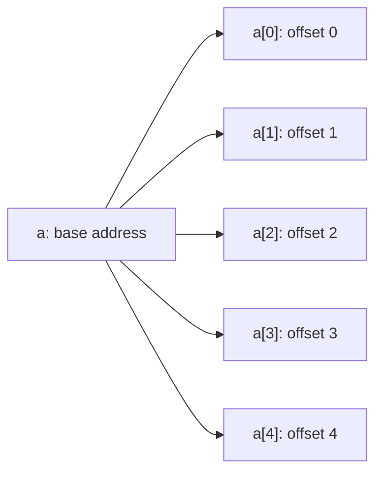
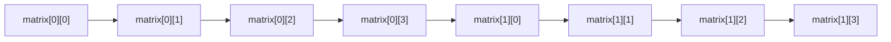

# **Arrays in C++**

An array is a fixed-size, contiguous block of memory that holds a
sequence of elements **all of the same type**. It is the simplest
container in C++ — there is no resizing, no bounds checking, and no
member functions. You get raw storage plus indexing into it.

Use arrays when you know exactly how many elements you need, when the
size is constant, and when you want the fastest possible access.
Reach for `std::vector` (or another STL container) when you need
resizing or safety.

---

## **1. Declaring an array**

An array declaration needs three things: the type of each element,
the array's name, and a constant size.

```cpp
type name[size];
```

```cpp
int scores[5];              // 5 ints, uninitialized
double temperatures[7];     // 7 doubles, uninitialized
char buffer[256];           // 256 chars
```

### **Rules**

- `size` must be a compile-time constant (a literal, a `const int`,
  a `constexpr`, or an enumeration). In C++ you cannot write
  `int n = 10; int a[n];` and expect it to work — use `std::vector`
  for that.
- If `size` is omitted entirely, the compiler figures it out from
  the initializer list (see below).
- Arrays of `int` and other built-in types are **not zero-initialized
  by default**. They contain whatever was in that memory before.

```cpp
int a[5];                   // contains garbage
int b[5] = {};              // all five are zero
```

---

## **2. Initializing an array**

There are several ways to seed the contents of an array.

### **Initializer list**

```cpp
int primes[5] = {2, 3, 5, 7, 11};
int fib[5]    = {1, 1, 2, 3};     // last element becomes 0
int zeros[5]  = {};              // all zeros
```

If you list fewer values than the size, the rest become zero. If you
list more, the compiler errors out.

### **Inferred size**

```cpp
int primes[] = {2, 3, 5, 7, 11};   // size is 5, inferred
```

### **Designated initializers (C++20)**

You can pick which slot each value goes into. Slots you skip become
zero.

```cpp
int scores[10] = {[3] = 90, [7] = 85};   // scores[3]=90, scores[7]=85, rest 0
```

### **Character arrays — string literal shortcut**

```cpp
char greeting[] = "hello";     // size is 6 (5 letters + '\0')
```

A string literal always ends with a hidden `'\0'`, so this array has
six slots, not five.

---

## **3. Accessing elements — indexing**

Elements are accessed by writing the array name and the index inside
square brackets. **Indexes start at zero** and go up to `size - 1`.

```cpp
int a[5] = {10, 20, 30, 40, 50};
std::cout << a[0];      // 10  — first
std::cout << a[4];      // 50  — last
std::cout << a[5];      // UNDEFINED — out of bounds, no error, no check
```

C++ does **no bounds checking** on plain arrays. Reading or writing
past the end is the single most common source of bugs and security
issues in C and C++. Tools like sanitizers (`-fsanitize=address`) can
catch this; run them while developing.

### **Why zero-based?**

Because the index is an *offset* from the start. `a[0]` is "the
element at offset zero," `a[3]` is "the element at offset three."
This makes the math `a[i]` literally equivalent to `*(a + i)`.

### **Flow diagram**



---

## **4. Size, length, and `sizeof`**

Plain arrays do not know their own length. There is no `.size()` or
`.length()` member.

### **`sizeof`**

```cpp
int a[5];
std::cout << sizeof(a);          // 20 on most platforms (5 ints × 4 bytes)
std::cout << sizeof(a) / sizeof(a[0]);   // 5 — the number of elements
```

This is the canonical C-style "size of an array." It works only
because `sizeof` on a true array does not decay to a pointer (see
section 9).

### **`std::size` (C++17)**

Cleaner and type-correct.

```cpp
#include <iterator>
int a[5] = {1, 2, 3, 4, 5};
std::cout << std::size(a);       // 5
```

### **`std::ssize` (C++20)**

Same as `std::size` but returns a signed integer — useful because
array indexes can legally be negative when using pointer tricks.

```cpp
std::cout << std::ssize(a);      // 5, type std::ptrdiff_t
```

---

## **5. Iterating over an array**

### **Classic `for` loop with index**

```cpp
int a[5] = {1, 2, 3, 4, 5};
for (int i = 0; i < 5; ++i) {
    std::cout << a[i] << " ";
}
```

You need the index when you also need to *write* elements or when
you are walking two arrays in lockstep.

### **Range-based `for` loop (C++11)**

The cleanest way to read elements.

```cpp
for (int x : a) {
    std::cout << x << " ";
}
```

For writing, take a reference:

```cpp
for (int& x : a) {
    x *= 2;                       // doubles every element in place
}
```

For read-only access without copying, use `const&`:

```cpp
for (const int& x : a) {
    std::cout << x << "\n";
}
```

### **Pointer-based loop**

How the language thinks about indexing under the hood.

```cpp
for (int* p = a; p < a + 5; ++p) {
    std::cout << *p << " ";
}
```

This is what the compiler turns the other loops into eventually.

---

## **6. Multidimensional arrays**

A 2D array is "an array of arrays." Think of it as a grid.

```cpp
int grid[3][4];                  // 3 rows, 4 columns
int matrix[2][3] = {
    {1, 2, 3},
    {4, 5, 6}
};
```

### **Accessing elements**

```cpp
grid[row][col]                   // index from 0
matrix[1][2]                     // 6 — second row, third column
```

### **Iterating**

```cpp
for (int i = 0; i < 2; ++i) {
    for (int j = 0; j < 3; ++j) {
        std::cout << matrix[i][j] << " ";
    }
    std::cout << "\n";
}
```

### **Memory layout**

All elements live in one contiguous block, in **row-major order**.
`matrix[1][0]` comes right after `matrix[0][3]` in memory, not in
its own little sub-array.



### **3D and beyond**

`int cube[2][3][4]` works the same way — an array of arrays of
arrays. Beyond two dimensions, code gets hard to read, and a single
flattened `std::vector` with manual indexing is often clearer.

---

## **7. Arrays of structs and classes**

Because every element is one of the same type, you can store
user-defined types directly.

```cpp
struct Point { double x, y; };

Point polyline[3] = {
    {0.0, 0.0},
    {1.5, 2.0},
    {3.0, 4.5}
};

polyline[1].x = 1.6;             // dot access on the element
```

The array stores the structs inline in memory; there is no separate
allocation per element.

---

## **8. Constant arrays**

Marking the array `const` (or making its elements `const`) locks its
contents after initialization.

```cpp
const int daysInMonth[] = {31, 28, 31, 30, 31, 30,
                           31, 31, 30, 31, 30, 31};
// daysInMonth[0] = 99;          // ERROR — read-only
```

A `const` array is also a useful way to embed lookup tables that
should never change.

---

## **9. Array-to-pointer decay**

This is the single most important thing to understand about arrays.

When you use an array in most expressions, it **decays** to a pointer
to its first element. The array's name "becomes" the address of
`a[0]`.

```cpp
int a[5] = {10, 20, 30, 40, 50};
int* p = a;          // a decays; p points to a[0]
std::cout << *p;     // 10
std::cout << p[2];   // 30 — pointer + index syntax
```

### **Where decay happens**

- Assigning to a pointer: `int* p = a;`
- Passing to a function parameter: `void f(int* p);`
- Applying `+`, `-`, or other arithmetic.
- Applying the unary `*` to read a value.

### **Where it does NOT happen**

- `sizeof(a)` returns the size of the whole array, not a pointer.
- `&a` returns a pointer to the *array*, type `int(*)[5]`, not
  `int*`.
- Initializing a reference: `int (&r)[5] = a;`
- `std::begin(a)` / `std::end(a)` — these still need the actual
  size information.

### **Why this matters**

Once an array has decayed, the size information is gone. That is why
plain C functions that take arrays must also take a length parameter:

```cpp
void print(int* p, int n);       // must pass length separately
print(a, 5);                    // a decays; size passed by hand
```

---

## **10. Passing arrays to functions**

### **Pointer + length (the C style)**

```cpp
void print(const int* p, std::size_t n) {
    for (std::size_t i = 0; i < n; ++i) {
        std::cout << p[i] << " ";
    }
    std::cout << "\n";
}

int data[3] = {1, 2, 3};
print(data, std::size(data));
```

Inside `print`, `p` is just a pointer; the function has no way to
know how big the array is unless you tell it.

### **Reference to a fixed-size array (the safe C++ style)**

```cpp
void print(const int (&arr)[5]) {
    for (int x : arr) {            // size is known here
        std::cout << x << " ";
    }
    std::cout << "\n";
}

int data[5] = {1, 2, 3, 4, 5};
print(data);                      // size matches — compile-time check
```

This works only when the caller really has an array of exactly that
size. Trying to pass an `int[3]` to a function expecting `int(&)[5]`
is a compile error.

### **Template trick for any size**

```cpp
template <std::size_t N>
void print(const int (&arr)[N]) {
    for (int x : arr) std::cout << x << " ";
    std::cout << "\n";
}
```

The compiler deduces `N` from the argument. This is the closest
plain arrays get to "knowing their own length."

---

## **11. `std::array` — fixed-size with member functions**

`<array>` provides a thin wrapper around the C array that adds
`size()`, bounds-checked `.at()`, iterators, and the ability to copy
and assign.

```cpp
#include <array>

std::array<int, 5> a = {1, 2, 3, 4, 5};

std::cout << a.size();           // 5 — member function!
std::cout << a.at(2);            // 3, throws if out of bounds
std::cout << a[2];               // 3, no bounds check (raw access)

a.fill(0);                       // all five become 0
a.swap(otherArray);              // swap contents with another std::array
```

`std::array` is just as fast as a plain array — it has no
heap allocations and no indirection. Use it whenever you want a
fixed-size container that plays well with the rest of the STL.

| | C array `int a[5]` | `std::array<int, 5>` |
|---|---|---|
| Knows its size | No | Yes (`.size()`) |
| Bounds-checked access | No | Yes (`.at(i)`) |
| Copyable / assignable | No | Yes |
| Works with STL algorithms | Awkward | Naturally |
| Cost | Zero overhead | Zero overhead |

---

## **12. Dynamic arrays — a peek**

When you do not know the size at compile time, the standard tool is
`std::vector`. If you must do it the raw way:

```cpp
int n;
std::cin >> n;
int* a = new int[n];             // n ints on the heap
// ... use a ...
delete[] a;                      // MUST delete[] (with the brackets)
```

`new[]` and `delete[]` must match. Mixing `new` with `delete[]` (or
vice versa) is undefined behavior. In modern C++, you almost never
see this — use `std::vector` and let it manage the memory.

---

## **13. Common pitfalls**

### **Forgetting the size of the initializer**

```cpp
int a[] = {1, 2, 3};
std::cout << sizeof(a) / sizeof(a[0]);   // 3
```

If you forget to declare the size and use `sizeof` on a pointer by
mistake, you will silently print the wrong number.

### **Off-by-one**

```cpp
int a[5];
for (int i = 0; i <= 5; ++i) {    // BUG: should be < 5
    a[i] = 0;                     // a[5] is out of bounds on the last iter
}
```

### **Decay losing the size**

```cpp
void f(int* p) { /* p has no idea how big the array is */ }
int a[5];
f(a);                             // size info gone, must pass it separately
```

### **Returning an array from a function**

```cpp
int* makeArray() {
    int local[5] = {1, 2, 3, 4, 5};
    return local;                 // BUG: local dies, returned pointer dangles
}
```

C++ has no "array return" type. If you need to return one, return a
`std::array`, a `std::vector`, or a pointer to data the caller owns.

### **Comparing arrays with `==`**

```cpp
int a[3] = {1, 2, 3};
int b[3] = {1, 2, 3};
if (a == b) { /* ... */ }         // compares pointers, not contents — almost never what you want
```

Arrays do not have a built-in equality. Use `std::array` (which
does), `std::vector`, or compare element by element.

---

## **14. Quick reference**

| Operation | Syntax |
|---|---|
| Declare | `int a[5];` |
| Declare and init | `int a[5] = {1,2,3,4,5};` |
| Inferred size | `int a[] = {1,2,3};` |
| Zero-init | `int a[5] = {};` |
| Read element | `x = a[i];` |
| Write element | `a[i] = x;` |
| Size in elements | `sizeof(a) / sizeof(a[0])` or `std::size(a)` |
| First element | `a[0]` or `*a` |
| Last element | `a[std::size(a) - 1]` |
| Iterate | `for (int x : a)` |
| Iterate writable | `for (int& x : a)` |
| Pass to function | decay — pass length too |

When in doubt, prefer `std::array` (fixed size) or `std::vector`
(growable). They give you size, iterators, and STL compatibility for
free, and they cost nothing in performance over a plain array.
