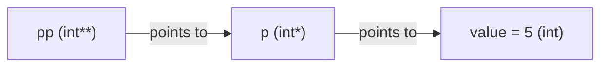

# **Pointers in C++**

A pointer is a variable that stores a **memory address** instead of a
value. Where `int x = 5;` stores the number 5, `int* p = &x;` stores
*where in memory* `x` lives. Pointers are how C++ lets you refer to,
share, and modify data without copying it.

---

## **1. Why pointers exist**

Every variable lives at some address in memory. Normally you never
see that address — you just use the variable's name. A pointer lets
you capture that address explicitly, so you can:

- Let a function modify the caller's actual variable (not a copy)
- Refer to the same data from more than one place, cheaply
- Allocate memory whose size is only known while the program is running
- Build linked structures (linked lists, trees) where one node points
  to the next

### **Memory, conceptually**

```
Address     Value
--------    -----
0x1000      5        <-- variable x lives here
0x1004      0x1000   <-- variable p lives here, and its VALUE is x's address
```

```cpp
int x = 5;
int* p = &x;
```

`p` is not `5`. `p` is `0x1000` (or whatever address `x` happens to
get). `*p` means "go to the address stored in `p`, and give me the
value sitting there" — which is `5`.

---

## **2. Declaring and using a pointer**

### Syntax

```cpp
type* pointerName;        // declares a pointer to `type`
pointerName = &variable;  // & = "address of" — assigns an address
```

The `*` in a declaration means "this is a pointer to `type`", not
"dereference" — the two uses of `*` look identical but mean opposite
things depending on where they appear. This is one of the most common
sources of beginner confusion.

### Example

```cpp
#include <iostream>

int main() {
    int rollNumber = 21;
    int* rollPtr = &rollNumber;    // rollPtr holds the ADDRESS of rollNumber

    std::cout << "rollNumber       = " << rollNumber << "\n";
    std::cout << "&rollNumber      = " << &rollNumber << "\n";  // an address
    std::cout << "rollPtr          = " << rollPtr << "\n";      // same address
    std::cout << "*rollPtr         = " << *rollPtr << "\n";     // 21, dereferenced

    *rollPtr = 22;                  // writes THROUGH the pointer
    std::cout << "rollNumber now   = " << rollNumber << "\n";   // 22

    return 0;
}
```

Output (addresses will differ every run):
```
rollNumber       = 21
&rollNumber      = 0x7ffe3a2c1b3c
rollPtr          = 0x7ffe3a2c1b3c
*rollPtr         = 21
rollNumber now   = 22
```

`rollPtr` and `&rollNumber` print the same value — because `rollPtr`
literally stores that address. Writing to `*rollPtr` is the same as
writing to `rollNumber` itself.

### The two meanings of `*`

| Context | Meaning |
|---|---|
| `int* p;` (in a declaration) | "p is a pointer to int" |
| `*p = 5;` (in an expression) | "dereference p — go to what it points at" |

---

## 3. `nullptr` — a pointer that points nowhere

A pointer that has not been given a valid address should be set to
`nullptr`, not left uninitialized.

```cpp
int* p = nullptr;

if (p == nullptr) {
    std::cout << "p does not point at anything yet\n";
}

// *p;   // DEREFERENCING A NULL POINTER IS UNDEFINED BEHAVIOUR — usually a crash
```

Older code sometimes uses `NULL` or plain `0` for this. `nullptr`
(C++11) is preferred because it has its own type (`std::nullptr_t`)
and cannot accidentally be confused with the integer `0` in overload
resolution.

**Rule:** always check a pointer against `nullptr` before
dereferencing it if there is any chance it might not point at
something valid.

```cpp
void printValue(int* p) {
    if (p != nullptr) {
        std::cout << *p << "\n";
    } else {
        std::cout << "nothing to print\n";
    }
}
```

---

## 4. Pointers and functions — pass by pointer

Passing a pointer lets a function reach the caller's actual variable
instead of getting a copy.

```cpp
#include <iostream>

void addTen(int* value) {
    *value = *value + 10;    // modifies the CALLER's variable
}

int main() {
    int marks = 50;
    addTen(&marks);
    std::cout << "marks = " << marks << "\n";   // 60
    return 0;
}
```

Compare with pass-by-value, which only ever sees a copy:

```cpp
void addTenWrong(int value) {
    value = value + 10;      // modifies a LOCAL COPY, caller sees no change
}
```

| Pass style | Caller's variable changes? | Syntax at call site |
|---|---|---|
| By value: `void f(int x)` | No | `f(marks)` |
| By pointer: `void f(int* x)` | Yes, if not null | `f(&marks)` |
| By reference: `void f(int& x)` | Yes, always | `f(marks)` |

Pointers can also be `nullptr` (an optional argument, "no value
given"); references cannot be null at all. That is the main reason to
choose a pointer parameter over a reference parameter.

---

## 5. Pointers and arrays

An array's name, used in most expressions, "decays" into a pointer to
its first element.

```cpp
#include <iostream>

int main() {
    int marks[4] = {90, 80, 70, 60};
    int* p = marks;              // same as: int* p = &marks[0];

    std::cout << *p << "\n";     // 90  (first element)
    std::cout << *(p + 1) << "\n";   // 80  (second element)
    std::cout << p[2] << "\n";       // 70  (pointer indexing works too)

    return 0;
}
```

### Pointer arithmetic

`p + 1` does NOT mean "add 1 to the address". It means "move forward
by one `sizeof(*p)`". For `int* p`, `p + 1` advances by 4 bytes (on
most systems); for `double* p`, it would advance by 8.

```cpp
int arr[3] = {10, 20, 30};
int* p = arr;

std::cout << p << "\n";        // e.g. 0x1000
std::cout << (p + 1) << "\n";  // e.g. 0x1004 (4 bytes later, not 1 byte)
```

### Walking an array with a pointer

```cpp
int marks[5] = {90, 85, 70, 60, 40};
int* p = marks;

for (int i = 0; i < 5; ++i) {
    std::cout << *(p + i) << " ";
}
// 90 85 70 60 40
```

`p[i]` and `*(p + i)` mean exactly the same thing — `[]` on a pointer
is defined as shorthand for pointer arithmetic plus a dereference.

---

## 6. `const` with pointers — three different meanings

Read the declaration **right to left** from the variable name.

```cpp
int value = 10;

const int* p1 = &value;        // pointer to CONST int: cannot modify *p1
int* const p2 = &value;        // CONST pointer to int: cannot reseat p2
const int* const p3 = &value;  // both: cannot modify *p3, cannot reseat p3
```

```cpp
*p1 = 20;      // ERROR: p1 points at data you promised not to change
p1 = nullptr;  // fine: p1 itself can be reseated

*p2 = 20;      // fine: the DATA is writable
p2 = nullptr;  // ERROR: p2 itself is const, cannot be reseated

*p3 = 20;      // ERROR
p3 = nullptr;  // ERROR
```

| Declaration | Data (`*p`) | Pointer (`p`) |
|---|---|---|
| `const int* p` | read-only | reseatable |
| `int* const p` | writable | fixed |
| `const int* const p` | read-only | fixed |

A quick trick: read from right to left. `const int* const p3` reads
as "`p3` is a `const` pointer to a `const int`".

---

## 7. Dynamic memory — `new` and `delete`

So far every pointer has pointed at a variable that already existed.
`new` creates a variable on the **heap** at runtime, and gives you
back a pointer to it. You are responsible for freeing it with
`delete` when done — the compiler does not do this automatically.

```cpp
#include <iostream>

int main() {
    int* p = new int;       // allocates one int on the heap, uninitialized
    *p = 42;
    std::cout << *p << "\n";

    delete p;                // frees the memory
    p = nullptr;              // good practice: avoid a dangling pointer

    int* arr = new int[5];   // allocates an array of 5 ints
    for (int i = 0; i < 5; ++i) {
        arr[i] = i * 10;
    }
    std::cout << arr[3] << "\n";   // 30

    delete[] arr;             // note: [] required for array new/delete
    arr = nullptr;

    return 0;
}
```

**Critical rule:** every `new` needs exactly one matching `delete`;
every `new[]` needs exactly one matching `delete[]`. Mixing them
(`delete` on a `new[]` result, or vice versa) is undefined behaviour.

### Memory leak

```cpp
void leak() {
    int* p = new int(5);
    // function ends without delete p; — that memory is now UNREACHABLE
    // and UNFREEABLE for the rest of the program's life
}
```

Every time `leak()` runs, 4 more bytes (or however much) are lost
until the program exits. This is called a **memory leak**.

### Dangling pointer

```cpp
int* p = new int(10);
delete p;
// p still holds the OLD address, but that memory is no longer valid

std::cout << *p;   // UNDEFINED BEHAVIOUR — reading freed memory
```

Setting `p = nullptr;` immediately after `delete p;` turns a silent,
hard-to-find bug into an obvious crash (or an `if (p)` check) the next
time someone tries to use it.

### Modern C++ note

Manual `new`/`delete` is largely a legacy pattern in modern C++.
Smart pointers (`std::unique_ptr`, `std::shared_ptr`) automate the
`delete` for you and are strongly preferred in real code — they are
covered in their own chapter, but it is worth knowing this section
describes the mechanism they are built to replace.

---

## 8. Pointer to pointer

A pointer can itself have an address, stored in another pointer.

```cpp
int value = 5;
int* p = &value;
int** pp = &p;      // pp holds the ADDRESS of p

std::cout << value << "\n";     // 5
std::cout << *p << "\n";        // 5
std::cout << **pp << "\n";      // 5  (dereference twice)

**pp = 10;
std::cout << value << "\n";     // 10 — changed through two levels
```



This pattern shows up when a function needs to modify a caller's
pointer itself (not just what it points to) — for example, a function
that allocates memory and needs to hand the new pointer back through
a parameter.

---

## 9. `void*` — the type-erased pointer

`void*` can point at anything, but cannot be dereferenced directly —
the compiler has no idea what type is stored there, so it must be
cast back to a real pointer type first.

```cpp
int number = 42;
void* generic = &number;

// std::cout << *generic;          // ERROR: cannot dereference void*
std::cout << *static_cast<int*>(generic) << "\n";   // 42, after casting back
```

Used for C-style generic APIs (`memcpy`, `malloc`, callback systems)
where the exact type is decided by the caller, not the function
itself.

---

## 10. Function pointers (brief preview)

A pointer can also point at a function, not just at data.

```cpp
#include <iostream>

int add(int a, int b) { return a + b; }
int multiply(int a, int b) { return a * b; }

int main() {
    int (*operation)(int, int) = add;      // operation POINTS AT add
    std::cout << operation(3, 4) << "\n";  // 7

    operation = multiply;                   // now points at multiply
    std::cout << operation(3, 4) << "\n";  // 12

    return 0;
}
```

This lets you choose *which function to call* at runtime — useful for
callbacks and simple strategy-style code. Modern C++ often reaches
for `std::function` or lambdas instead, covered separately.

---

## 11. Pointers vs references — when to use which

| | Pointer | Reference |
|---|---|---|
| Can be null | Yes (`nullptr`) | No, must refer to something |
| Can be reseated | Yes | No, bound once, forever |
| Needs `&` to create | Yes, explicit | Only at the point of binding |
| Needs `*` to use | Yes, explicit | No, used like the original variable |
| Typical use | Optional data, dynamic memory, arrays | "give me a real alias for this variable" |

```cpp
int a = 5, b = 10;

int* p = &a;
p = &b;          // fine: pointer reseated to point at b instead

int& r = a;
// r = b;        // this does NOT reseat r — it ASSIGNS b's value into a
```

Rule of thumb: prefer references when a value must always be present
and never needs to change what it refers to; use pointers when "no
value" is a valid state, or when the target may need to change later.

---

## 12. Common pitfalls

**Dereferencing an uninitialized pointer**
```cpp
int* p;          // NOT initialized — points at garbage
std::cout << *p; // undefined behaviour, may crash or may not
```
Always initialize a pointer, even if only to `nullptr`.

**Returning the address of a local variable**
```cpp
int* dangerous() {
    int local = 5;
    return &local;      // local is DESTROYED when the function returns
}                        // the returned pointer is now dangling
```
Never return the address of a variable that lives only inside the
function — it will not exist anymore by the time the caller uses it.

**Forgetting `delete`, or using after `delete`**
Covered in Section 7 — leaks and dangling pointers are the two most
common heap-related bugs in C++.

**Confusing `*` in a declaration vs an expression**
```cpp
int* a, b;    // a is int*, but b is just a plain int! * only binds to a
int *a, *b;   // clearer: both are pointers
```
When declaring multiple pointers on one line, repeat the `*` for each
name, or declare them on separate lines to avoid this trap entirely.

---

## 13. Quick reference

| Syntax | Meaning |
|---|---|
| `int* p;` | p is a pointer to int |
| `&x` | address-of x |
| `*p` | dereference p (the value p points to) |
| `nullptr` | a pointer that points at nothing |
| `const int* p` | pointer to a const int (data locked) |
| `int* const p` | const pointer to int (pointer locked) |
| `new T` | allocate one T on the heap, returns T* |
| `new T[n]` | allocate an array of n T's, returns T* |
| `delete p` | free memory from a single `new` |
| `delete[] p` | free memory from a `new[]` |
| `p1 == p2` | do p1 and p2 hold the same address? |
| `void*` | pointer to an unspecified type |

---

## 14. Practice (try these yourself)

- Write a `swap(int* a, int* b)` function that swaps two values using
  pointers, and call it from `main`.
- Declare `const int* p`, try to modify `*p`, and read the compiler
  error. Then declare `int* const p` and try to reseat it instead.
- Allocate an array of 10 ints with `new[]`, fill it with squares
  (0, 1, 4, 9, ...), print it, then free it correctly.
- Write a function that deliberately returns the address of a local
  variable, call it, and predict what happens before you run it.
- Given `int a = 5;` and `int* p = &a;`, write out by hand what `p`,
  `*p`, and `&p` each print, then verify against the real output.
- Build a tiny `int**` example: three integers, `p` pointing at the
  first, `pp` pointing at `p`; change the integer's value by writing
  through `**pp`.
- Write a function pointer variable that can hold either an `add` or
  a `subtract` function, and switch between them based on user input.