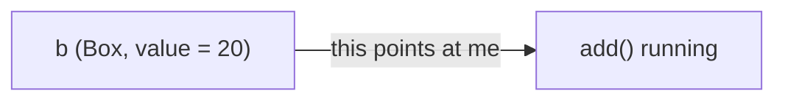
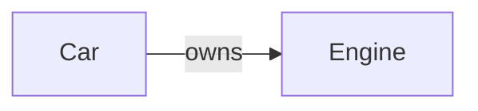

# **Object-Oriented Programming in C++**

C structs let you bundle data together. C++ classes let you bundle
data **and the functions that work on that data**, while controlling
exactly what the rest of the program is allowed to see and touch.
That second idea — grouping behaviour with the data it operates on,
and protecting both behind a clear boundary — is the entire point of
object-oriented programming.

This chapter covers the foundation: how to define a class, how to
create and use objects from it, and the core mechanisms (encapsulation,
constructors, the destructor, `this`, `static` members) that make a
class a real, self-contained type. Inheritance and runtime polymorphism
get their own dedicated treatment later — this chapter ends with a
preview so the vocabulary does not look unfamiliar when it appears.

---

## 1. The four ideas behind OOP

Most introductions list the "four pillars of OOP". They are easier to
remember if you read them as four separate *questions* a type should
answer well.

| Pillar | The question it answers |
|---|---|
| **Encapsulation** | How do I keep the inside of an object safe from outside code? |
| **Abstraction** | How do I expose just what is needed, hiding the rest? |
| **Inheritance** | How do I say "this new thing is a kind of that thing"? |
| **Polymorphism** | How do I let one piece of code work on many kinds of thing? |

C++ does not force every class to do all four — encapsulation alone is
often enough for the simplest types. The rest of this chapter
introduces the language features that make each pillar possible,
starting with the most basic one: the class itself.

---

## 2. Classes and objects — defining and instantiating

A **class** is a blueprint. An **object** (also called an *instance*)
is what gets built from that blueprint. The class says "this kind of
thing has these pieces of data, and these operations". Objects are the
actual pieces of data sitting in memory.

### Syntax

```cpp
class ClassName {
    // members go here
};      // <-- semicolon is REQUIRED
```

### A minimal class

```cpp
#include <iostream>
#include <string>

class Student {
    // data members (what a student HAS)
    std::string name;
    int         rollNumber;

public:
    // member functions (what a student CAN DO)
    void introduce() {
        std::cout << "Hi, I'm " << name
                  << ", roll " << rollNumber << "\n";
    }
};

int main() {
    Student alice;                // an object: one Student built from the blueprint
    Student bob;                  // a different object

    alice.introduce();            // uses alice's data
    bob.introduce();              // uses bob's data
    return 0;
}
```

The above compiles, but `name` and `rollNumber` are uninitialised
strings/ints — Alice and Bob will print with whatever junk was sitting
in that memory. The next sections fix that with constructors and
access control.

### Class vs struct, in C++ specifically

In C++ the **only** difference is the default access:

| Keyword | Default access for members | Typical use |
|---|---|---|
| `class`  | `private` | types with real behaviour / invariants |
| `struct` | `public`  | plain data aggregates, like C structs |

Everything else (inheritance, constructors, member functions) is
identical between `class` and `struct`. Reach for `class` by default
once the type has non-trivial behaviour.

### Declaration vs definition

You can *declare* a class with just `class Student;` to say "this name
exists, details later" — useful when one class refers to another by
pointer. You *define* a class by providing its body, exactly once per
translation unit.

---

## 3. Access specifiers — public, private, protected

The contents of a class are sliced into three sections:

| Specifier | Who can see it |
|---|---|
| `public`    | Anyone — code outside the class, derived classes, friends |
| `protected` | The class itself, its friends, and anything derived from it |
| `private`   | The class itself and its friends only |

```cpp
class Account {
private:                        // default if you write `class`
    double balance;             // only Account can touch this directly

protected:
    std::string accountNumber;  // Account and its subclasses only

public:
    std::string owner;          // anyone can read/write this

    void deposit(double amount) {
        if (amount > 0) balance += amount;   // OK — Account can touch its own private parts
    }
};

int main() {
    Account a;
    a.owner = "Karan";            // OK — public
    // a.balance = 1000;          // ERROR: balance is private
    a.deposit(1000);              // OK — public function, modifies balance internally
}
```

Reading right to left: `private: double balance;` means "balance
is a `double`, and from now until the next access specifier, members
are **private**". You can list access specifiers in any order, and
repeat them — most classes just alternate `public:` and `private:`
sections.

### Why bother?

A class with all members `public` is effectively a struct. The point
of access control is to make the *internal* representation safe to
change later — as long as the public functions keep their behaviour,
the private parts can be reorganised freely without breaking any code
that uses the class.

A common pattern:

```cpp
class Counter {
private:
    int count;          // internal state — hidden

public:
    void increment();   // controlled way to change count
    int  current() const; // controlled way to read count
};
```

The compiler then enforces that outside code can only mutate `count`
through `increment()`, which is a single place to add bounds-checks,
logging, or thread-safety later.

---

## 4. Encapsulation — getters and setters

Encapsulation is the discipline of keeping data members `private` and
exposing them through small, deliberate `public` functions. Read/write
accessors are usually called *getters* and *setters*.

```cpp
#include <iostream>
#include <string>

class Student {
private:
    std::string name;
    int         rollNumber = 0;       // default member initialiser (C++11)

public:
    // setter: validates before storing
    void setName(const std::string& newName) {
        if (!newName.empty()) name = newName;
    }

    // getter: read-only access
    const std::string& getName() const {
        return name;
    }

    void setRoll(int r) {
        if (r > 0) rollNumber = r;
    }

    int getRoll() const {
        return rollNumber;
    }
};

int main() {
    Student s;
    s.setName("Karan");
    s.setRoll(21);

    std::cout << s.getName() << " (" << s.getRoll() << ")\n";
    // Karan (21)
}
```

### Why not just make `name` and `rollNumber` public?

Because then every place that sets them has to remember the rule
("don't store an empty name", "don't store a non-positive roll").
With a setter, the rule lives in **one** place and the compiler
enforces it everywhere else.

### `const` member functions

Notice `getName() const`. The trailing `const` is a promise: this
function will **not** modify the object's state. It lets you call
`getName()` on a `const Student`, and gives the compiler a chance to
catch a stray modification by accident. Non-mutating getters should
almost always be marked `const`.

---

## 5. Member functions and the `this` pointer

When a member function runs, it needs a hidden parameter — a pointer
to the object it was called on. That pointer's name is `this`.

```cpp
#include <iostream>

class Box {
private:
    int value;

public:
    Box(int v) : value(v) {}

    // returns a reference to the SAME object the call was made on
    Box& add(int n) {
        this->value += n;          // "my own value"
        return *this;              // "me, by reference"
    }

    void print() const {
        std::cout << "value = " << this->value << "\n";
    }
};

int main() {
    Box b(10);
    b.add(5).add(3).add(2);        // chained — each returns the same object
    b.print();                      // value = 20
}
```



`this` is implicit in most code — `value += n;` inside the member
function already means `this->value += n;`. You only have to write
`this->` when a parameter or local shadows a member, or when you want
to *return* a reference to the current object.

| Expression inside a member function | What it really means |
|---|---|
| `value`         | `this->value`         |
| `value += n`     | `this->value += n`    |
| `return *this;`  | "give them a reference to me" |
| `this == &b;`    | "am I the same object as b?" |

---

## 6. Constructors — building an object the right way

A constructor is a special member function that runs **automatically**
whenever an object is created. Its job is to leave the object in a
valid, usable state. Constructors have the same name as the class and
no return type.

```cpp
class Student {
private:
    std::string name;
    int         rollNumber;

public:
    Student();                       // default constructor (no arguments)
    Student(const std::string& n, int r);   // parameterised constructor
    Student(const Student& other);   // copy constructor
};
```

### Default constructor

A constructor with no parameters. Used when you write `Student s;`.

```cpp
Student::Student() : name("Unknown"), rollNumber(0) {
    // any extra setup goes here
}
```

If you write **no** constructors at all, the compiler generates a
*defaulted* default constructor for you — it default-initialises each
member. The moment you write any other constructor, that automatic
generation stops, so always provide a default constructor if your
class might be created without arguments.

### Parameterised constructor

```cpp
Student::Student(const std::string& n, int r)
    : name(n), rollNumber(r) {
}
```

```cpp
Student alice("Alice", 21);    // calls the parameterised constructor
```

### Constructor overloading

You can have as many constructors as you like, as long as their
parameter lists are distinguishable.

```cpp
Student::Student()                               : name("Unknown"),  rollNumber(0) {}
Student::Student(const std::string& n)           : name(n),         rollNumber(0) {}
Student::Student(const std::string& n, int r)    : name(n),         rollNumber(r)  {}
```

### The constructor initializer list

`: name(n), rollNumber(r)` is not assignment — it is **initialisation**.
For members that have a non-default constructor themselves
(`std::string`), or that must be `const`, or that have a reference
type, the initializer list is the **only** way to give them a value:

```cpp
class FixedID {
private:
    const int      id;           // cannot be assigned to — must be initialised
    std::string&   refToName;    // reference must be bound at construction
    std::string    label;

public:
    FixedID(int i, std::string& nameRef)
        : id(i), refToName(nameRef), label("user")  // required for id and refToName
    {}
};
```

You **can** assign in the body (`name = n;`) for ordinary members, but
prefer the initializer list anyway — it is more efficient and the
pattern is uniform.

### Default member initialisers (in-class defaults)

C++11 lets you give a member a default value directly in the class:

```cpp
class Student {
private:
    std::string name  = "Unknown";
    int         rollNumber = 0;
    // ...
};
```

If the constructor's initializer list does not mention a member, that
in-class default is used. This is the modern replacement for writing
an empty constructor body.

---

## 7. The copy constructor

When you write `Student copy = original;` (or pass an object by
value, or return one by value), C++ builds the new object by
**copying** the old one. The function that does this is the
**copy constructor**.

```cpp
Student::Student(const Student& other)
    : name(other.name), rollNumber(other.rollNumber) {
}
```

It takes a `const` reference to an object of the **same** type, and
duplicates its state.

```cpp
Student alice("Alice", 21);
Student copy(alice);             // explicit copy
Student alias = alice;           // also a copy (NOT an "alias" — different object)
```

A key rule: the parameter **must** be a reference. If it were
`Student(Student other)` by value, the call `Student s(other);` would
need to copy `other` to pass it in — calling the copy constructor to
call the copy constructor, with no end. Hence the reference.

The compiler writes a default copy constructor for you if you do not
— it copies each member in turn. That default is fine until a member
*owns* a resource (raw `new`-allocated memory, a file handle, etc.),
in which case you usually need a custom one or a smart pointer. This
is the *Rule of Three*, covered in Section 14.

---

## 8. The destructor

The destructor is the special member function that runs **automatically**
when an object is destroyed — when it goes out of scope, when a `new`
object is `delete`d, etc. Its job is to release whatever the object
owns.

```cpp
class Student {
public:
    ~Student();   // tilde + class name, no parameters, no return type
};
```

```cpp
Student::~Student() {
    // any cleanup goes here
    std::cout << "bye, " << name << "\n";
}
```

```cpp
int main() {
    Student s("Karan", 21);   // constructor runs
    {
        Student temp("Temp", 0);   // constructor runs
    }                               // destructor runs HERE for temp
    return 0;
}                                   // destructor runs HERE for s
```

### Automatic destruction — RAII

The single most important property of destructors is that they run
*automatically*, in the *reverse order* of construction, even when an
exception is thrown mid-function. This is what makes
**RAII** (Resource Acquisition Is Initialization) work — tie every
resource you allocate (memory, file handles, locks, sockets) to the
lifetime of an object, and the destructor guarantees it will be
released. `std::string`, `std::vector`, smart pointers, and the file
streams from `<fstream>` all work this way.

### When you must write a destructor yourself

The compiler generates a default destructor that calls each member's
destructor. Write your own **only** when the class owns a resource the
default path cannot free — raw `new`-allocated memory, a C-style file
handle, etc. Modern C++ strongly prefers storing that resource inside
a smart pointer or other RAII wrapper instead, in which case you can
let the compiler's destructor do its job. (See the Rule of Three /
Five / Zero, Section 14.)

```cpp
#include <iostream>

class File {
private:
    FILE* handle;

public:
    File(const char* path) : handle(std::fopen(path, "r")) {
        if (!handle) std::cout << "could not open file\n";
    }
    ~File() {
        if (handle) std::fclose(handle);   // guaranteed cleanup
    }
};
```

---

## 9. `static` members — data and functions shared by all objects

A `static` member belongs to the **class**, not to any one object.
Every `Student` shares the same copy of a `static` variable, and a
`static` function can be called without any object at all.

```cpp
#include <iostream>
#include <string>

class Student {
private:
    std::string name;
    static int  totalEnrolled;     // declaration only — defined below

public:
    Student(const std::string& n) : name(n) {
        ++totalEnrolled;
    }
    ~Student() {
        --totalEnrolled;
    }

    static int count() {                  // no `this`, no specific object
        return totalEnrolled;
    }
};

int Student::totalEnrolled = 0;           // definition — exactly once, outside the class

int main() {
    Student a("Alice");
    Student b("Bob");
    std::cout << Student::count() << "\n";   // 2
    {
        Student c("Carol");
        std::cout << Student::count() << "\n";   // 3
    }
    std::cout << Student::count() << "\n";   // 2 — c was destroyed
}
```

### The two rules

1. **`static` data members** must be **declared** inside the class
   (`static int totalEnrolled;`) and **defined** exactly once outside
   it (`int Student::totalEnrolled = 0;`).
2. **`static` member functions** have no `this` pointer, so they can
   only touch `static` data or other `static` functions inside the
   class. They are commonly used as factory methods, counters, and
   utility helpers that logically belong to the type.

---

## 10. `const` member functions (in detail)

A `const` member function promises not to modify the object's state
*as seen through `this`*. This unlocks three concrete benefits:

```cpp
class Counter {
private:
    int n = 0;

public:
    void increment()       { ++n; }            // mutating — not const
    int  current() const   { return n; }       // non-mutating — const
    void reset()           { n = 0; }          // mutating
};
```

### Benefit 1 — works on `const` objects

```cpp
const Counter frozen(5);
// frozen.increment();           // ERROR: frozen is const, can't call non-const function
std::cout << frozen.current();   // OK: current() is const
```

### Benefit 2 — accidentally mutating becomes a compile error

```cpp
int  bad() const {
    ++n;                            // ERROR: cannot modify inside a const member function
    return n;
}
```

### Benefit 3 — documents intent for the reader

`getName() const` instantly says "calling me does not change the
object" — readers do not have to guess.

### Mutable exception — `mutable`

For state that is technically part of the object but logically
"cache / lazy / non-observable", you can opt out of `const`:

```cpp
class Big {
private:
    std::string cached;
    mutable std::size_t lookups = 0;   // can change even from const member functions

public:
    const std::string& value() const {
        ++lookups;                     // OK because `mutable`
        return cached;
    }
};
```

Reach for `mutable` rarely — usually only for caches, lazy values, or
mutexes inside `const` methods.

---

## 11. Composition — the "has-a" relationship

The simplest way to build complex types out of simple ones: include
one type as a data member of another. A `Department` *has* a
`Student`. An `Engine` *has* a `Piston`.

```cpp
#include <iostream>
#include <string>

class Engine {
    int horsepower = 100;
public:
    int hp() const { return horsepower; }
};

class Car {
private:
    std::string model;
    Engine      engine;           // a Car HAS an Engine — by value

public:
    Car(const std::string& m) : model(m) {}

    void specs() const {
        std::cout << model << " — " << engine.hp() << " HP\n";
    }
};

int main() {
    Car c("Swift");
    c.specs();   // Swift — 100 HP
}
```



### By value vs by pointer/reference

| Form | Owns the contained object? | Lifetime tied to the container? |
|---|---|---|
| `Engine engine;` (by value)   | Yes — fully | Yes — destroyed with the container |
| `Engine* enginePtr;`          | No — only points at one | No — must manage yourself |
| `Engine& engineRef;`          | No — only refers to one | No — must exist independently |

By value is the simplest and safest. Use a pointer or reference only
when:
- the contained object must outlive the container,
- the container must be able to refer to *nothing* (a pointer),
- the contained object is too large or expensive to embed.

Composition is almost always the right first choice over inheritance —
prefer "has-a" until you can clearly articulate why "is-a" applies.

---

## 12. A first look at inheritance and polymorphism

> *Quick preview only — the next chapters cover these in depth.*

### Inheritance — "is-a"

```cpp
#include <iostream>
#include <string>

class Animal {
public:
    virtual void speak() const {           // virtual = "may be overridden"
        std::cout << "...\n";
    }
    virtual ~Animal() = default;           // virtual destructor — see below
};

class Dog : public Animal {                // Dog IS-A Animal
public:
    void speak() const override {          // override = "yes, this replaces the base version"
        std::cout << "Woof!\n";
    }
};

class Cat : public Animal {
public:
    void speak() const override {
        std::cout << "Meow!\n";
    }
};
```

### Polymorphism — same call, different behaviour

When `speak()` is `virtual`, the *runtime* type of the object decides
which version runs:

```cpp
int main() {
    Dog d;
    Cat c;
    Animal* animals[] = {&d, &c};          // base-class pointers to derived objects

    for (Animal* a : animals) {
        a->speak();                         // each one calls its OWN version
    }
}
// Woof!
// Meow!
```

Without `virtual`, `a->speak()` would always call `Animal::speak()`
and you'd see `...` twice. The `virtual` keyword is what makes
polymorphism work.

### Virtual destructors — must have

If a base class is meant to be derived from and deleted through a
base pointer, **its destructor must be `virtual`**. Otherwise only the
base part is destroyed when `delete`-ing a derived object through a
base pointer — a classic memory/resource leak.

```cpp
Animal* p = new Dog;
delete p;     // if ~Animal is NOT virtual: only Animal destructor runs
             // if ~Animal IS    virtual: both Dog and Animal destructors run
```

### The "rule" preview

| If you have... | You probably need... |
|---|---|
| a `virtual` function | a `virtual` destructor |
| a destructor that releases a resource | a copy constructor and copy assignment (and their move cousins) |
| ownership of dynamic memory | a smart pointer *or* a user-defined destructor + copy + move |

These are the Rule of Three / Five / Zero, summarised next.

---

## 13. The Rule of Three, Five, and Zero

These rules tell you which special member functions you need to write
yourself based on which ones you have already decided to provide.

### Rule of Three (C++98)

If you write **any** of:
- destructor
- copy constructor
- copy assignment (`operator=`)

…you almost certainly need **all three**. A class that needs a custom
destructor (because it owns a resource) also needs to handle what
happens when that resource is duplicated and reassigned.

```cpp
class Buffer {
private:
    char* data;
    std::size_t size;

public:
    Buffer(std::size_t n);                  // allocate
    ~Buffer();                             // release (Rule-of-3 says we need this...)
    Buffer(const Buffer& other);           // ...so we need copy ctor...
    Buffer& operator=(const Buffer& other); // ...and copy assignment
};
```

### Rule of Five (C++11)

Modern C++ adds two more special functions: move constructor and move
assignment. If you wrote any of the Rule-of-Three, you almost
certainly also need these — or you should explicitly disable them.

```cpp
class Buffer {
    // ...
public:
    Buffer(Buffer&& other) noexcept;            // move ctor
    Buffer& operator=(Buffer&& other) noexcept;  // move assignment
};
```

### Rule of Zero (modern preference)

Don't write **any** of them. Instead, store the resource inside an
RAII wrapper that already knows how to copy/move/destruct correctly.

```cpp
class Buffer {
private:
    std::vector<char> data;        // vector handles copy, move, and destruction itself

public:
    Buffer(std::size_t n) : data(n) {}
    // no destructor, no copy ctor, no copy assign, no move ctor, no move assign
};
```

This is the modern default. The Rule of Three/Five only apply when
you actually need to manage a resource that has no STL equivalent —
a C API handle, an OS-level resource, or a custom memory pool.

---

## 14. Common pitfalls

**Forgetting to initialise members**

```cpp
class Account {
    std::string name;        // default-constructed to ""
    int         balance;     // UNINITIALISED — contains garbage
};
```

Always prefer in-class default initialisers (`int balance = 0;`) or
initialiser lists in constructors to make this impossible to forget.

**Slicing**

```cpp
class Animal { /* ... */ virtual void speak() const; };
class Dog : public Animal { /* ... */ void speak() const override; };

Dog d;
Animal a = d;        // copies only the Animal part — Dog's data is sliced off
a.speak();           // calls Animal::speak(), not Dog::speak()
```

Pass and store polymorphic objects through **pointers** or
**references** (`Animal*`, `Animal&`) — never by value.

**Confusing `this->` with shadowing**

```cpp
class Box {
    int value;
public:
    void set(int value) {      // parameter shadows the member
        value = value;         // assigns parameter to itself, member unchanged
    }
};
```

Fix by naming the parameter differently, or by writing
`this->value = value;`. This is the most common reason to use `this`
explicitly.

**Writing `class` with all `public` data**

If everything is `public`, you might as well have used `struct`, and
you have lost the main benefit of having a class at all. Reach for
`class` only when you actually want to enforce invariants on the
state.

**`delete` through a non-virtual base destructor**

```cpp
class Base { public: ~Base() { /* ... */ } };          // NOT virtual
class Derived : public Base { public: ~Derived() { /* ... */ } };

Base* p = new Derived;
delete p;   // UNDEFINED BEHAVIOUR — only ~Base() runs, ~Derived() is skipped
```

Any class designed to be deleted polymorphically must declare its
destructor `virtual`.

**Returning a reference to a local object's member**

```cpp
class Bag {
    std::string label;
public:
    std::string& getLabel() {
        std::string local = "temp";    // local variable
        return local;                  // reference to local — dangling
    }
};
```

The reference will be dangling the moment `getLabel` returns.
References can only legitimately refer to objects that outlive the
function — parameters passed in by reference, members of `*this`, or
dynamically-allocated objects you still own.

---

## 15. Quick reference

| Syntax | Meaning |
|---|---|
| `class Name { ... };` | Define a class (members `private` by default) |
| `struct Name { ... };` | Same, but members `public` by default |
| `private:` / `protected:` / `public:` | Access specifiers |
| `Name obj;`             | Construct a default-initialised object |
| `Name obj(args);`       | Construct with arguments |
| `Name obj(other);`      | Copy-construct from `other` |
| `Name obj = std::move(other);` | Move-construct from `other` |
| `~Name();`              | Destructor — runs automatically at end of lifetime |
| `void f() const;`       | Const member function — does not modify state |
| `static int x;`         | Class-level data member — shared by all objects |
| `static void f();`      | Class-level function — no `this` |
| `this`                  | Pointer to the current object (inside member functions) |
| `this->member`          | Access current object's member (usually implicit) |
| `*this`                 | The current object itself (used when returning by reference) |
| `Class::member`         | Define a static member, or access a name inside the class |
| `: member(value), ...`  | Constructor initializer list |
| `= default;` / `= delete;` | Ask the compiler to generate / forbid a special function |
| `virtual void f();`     | Member function that derived classes can override |
| `virtual ~Name();`      | Virtual destructor — required for polymorphic deletion |
| `void f() override;`    | Mark a member as overriding a base virtual |

---

## 16. Practice (try these yourself)

- Write a `Rectangle` class with `private` `width` and `height`, `public`
  `setWidth`, `setHeight`, and a `const` `area()` function. Make the
  setters reject zero or negative values. Try to bypass the setters by
  reaching into `width` from `main` — read the compiler error.
- Add a `static int getCount()` to the `Rectangle` class that returns
  how many `Rectangle` objects are currently alive (increment in the
  constructor, decrement in the destructor). Construct a few, let some
  go out of scope, and verify the count.
- Implement a `Counter` class with a `private` `int n`, an
  `increment()` mutator, and a `current() const` getter. Call
  `current()` on a `const Counter` and on a non-`const` `Counter`;
  confirm both compile, then try calling `increment()` on a `const
  Counter` and read the error.
- Write `Student` with a `std::string name` member initialised to
  `"Unknown"` directly in the class. Then write two constructors: one
  default, one taking `(const std::string& n)` that uses the
  initializer list to set the name. Construct both ways from `main`.
- Add a copy constructor to `Student` that prints `"copying <name>"`
  when it runs. Construct one `Student`, then copy-construct another
  from it, and watch when the message fires (also when passing by
  value into a function).
- Define `Engine` and `Car` (composition), and add a `start()` method
  to `Car` that prints the engine's horsepower. Then refactor `Car` so
  the `Engine` is held by pointer instead of by value — note how the
  ownership semantics change.
- Define an `Animal` base class with a `virtual void speak() const`
  and a `virtual ~Animal()`. Derive `Dog` and `Cat` that override
  `speak()`. Store them in a `std::vector<Animal*>` and call
  `speak()` on each through a loop. Confirm each one makes its own
  sound — then remove `virtual` from `speak()` and `~Animal()` and
  see what changes.
- Take any class you wrote above that owns dynamic memory (`new` and
  a raw pointer member). Apply the Rule of Three: write the
  destructor, copy constructor, and copy assignment. Then refactor it
  to use `std::unique_ptr` instead and delete all three — that is the
  Rule of Zero in action.
